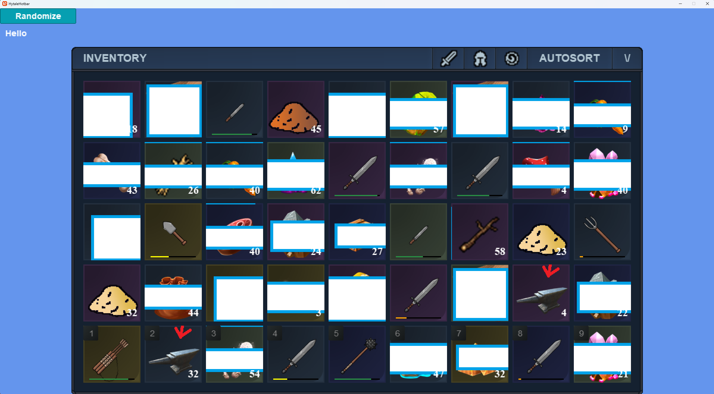
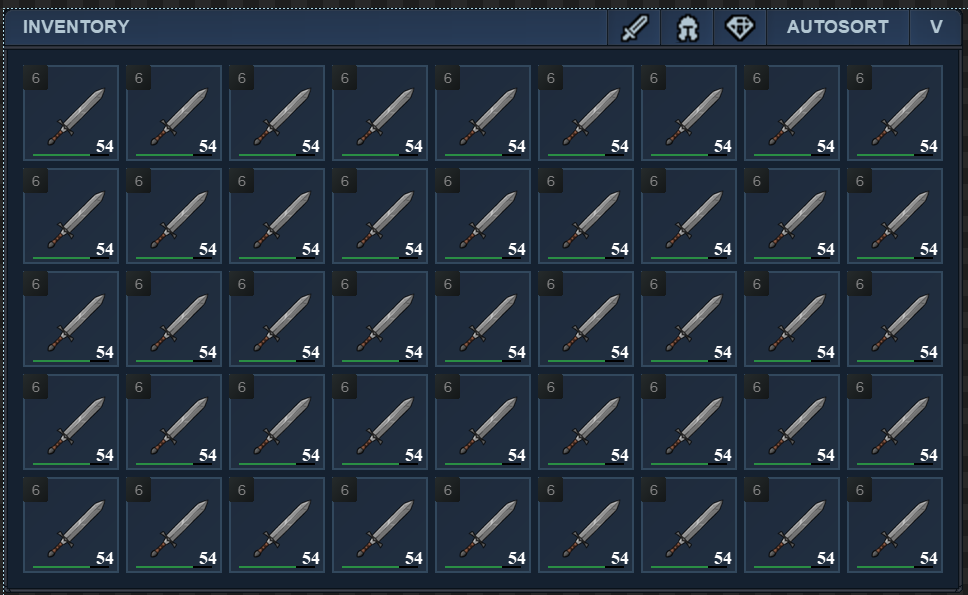
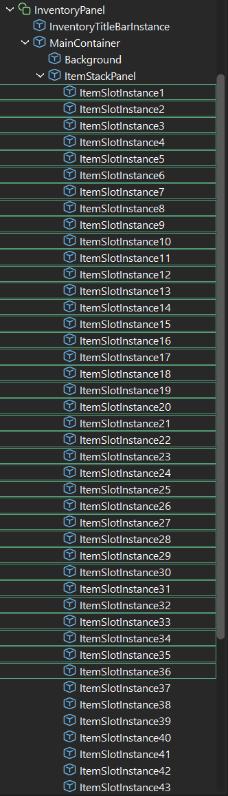
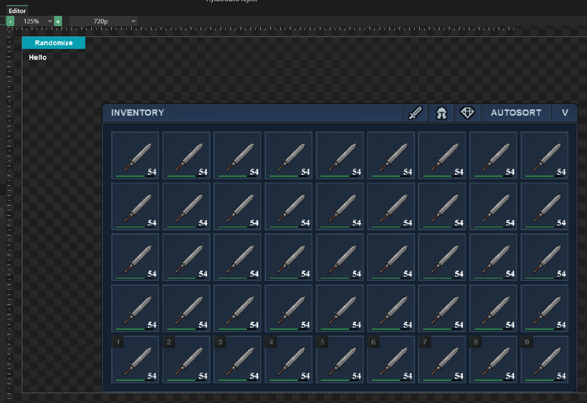
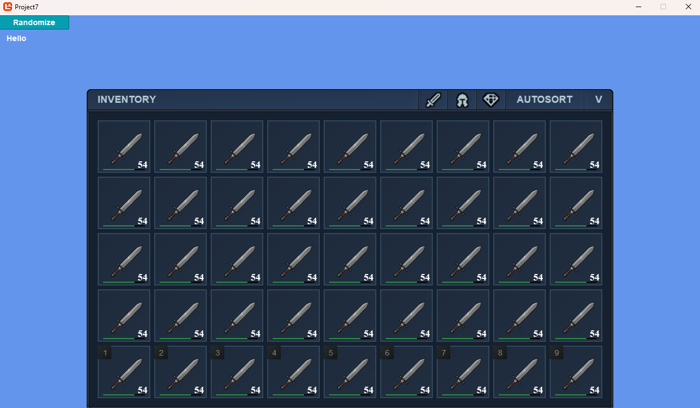
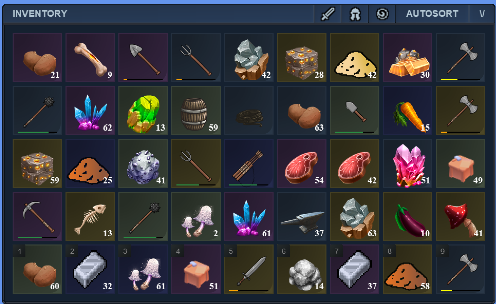
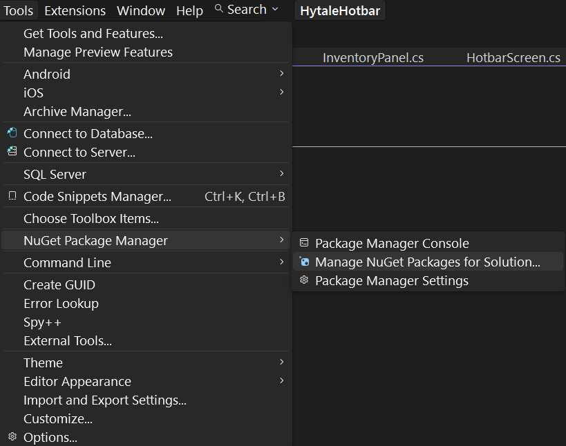
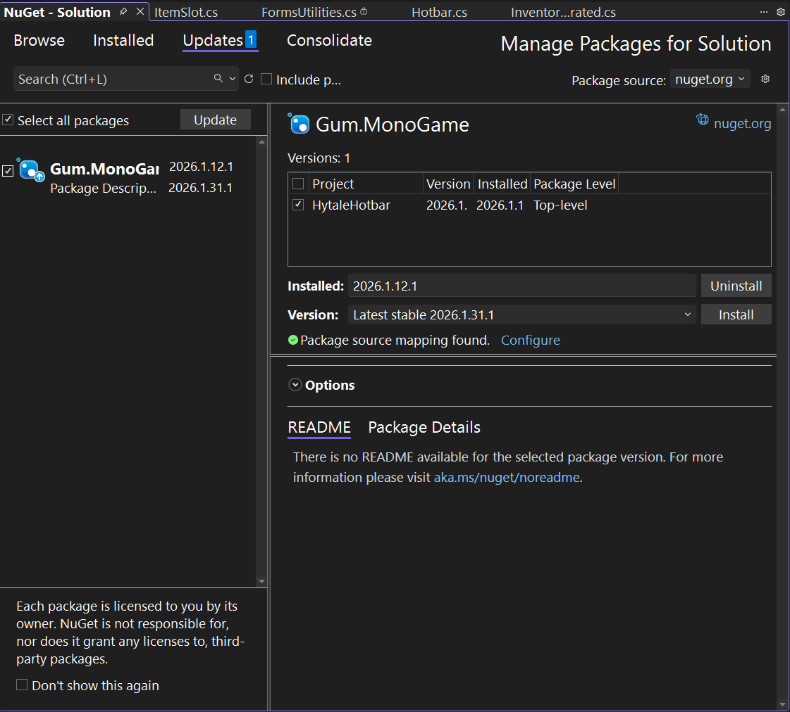
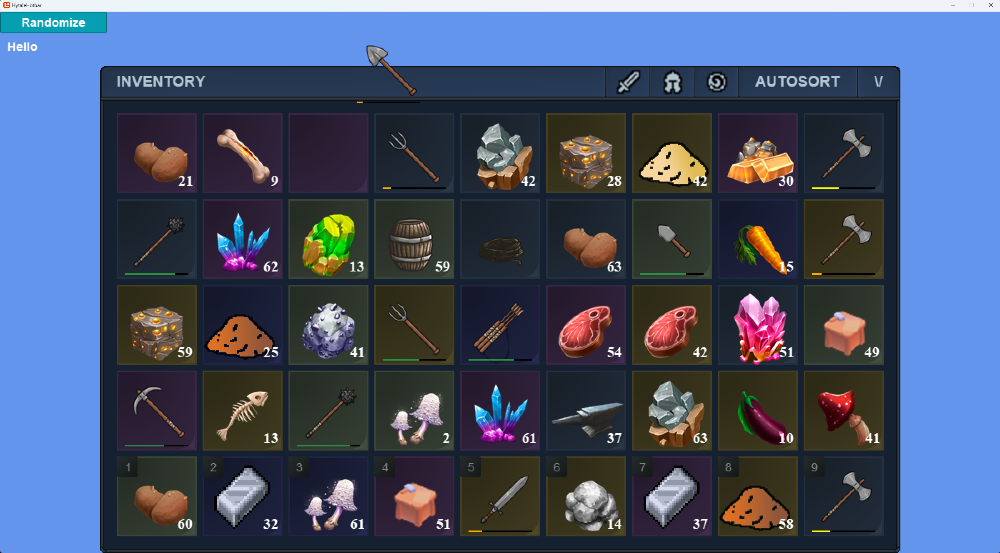

# 1. Intro

Alright I Hope these videos are helping you all.  I actually spent the last week refining the code and redoing it for part 4 because I wanted it to have more functionality.

What does that mean?  It means I've done a lot more, here is all we'll be doing in this video:
1. First we'll cleanup any things I forgot about in GUM from the last video.
2. Next, we'll Wire up the Inventory to appear or disappear when we press I (Or whatever tab or whatever key you want)
3. Then, we'll make sure we update the UI from the Inventory, which at this point is just the hotbar.
4. Make the randomize button work on the inventory component also.
5. Add in Dragging and Dropping (Basic)
6. Update the dragging and Dropping to also STACK items
7. Add sorting in the top right (I gave up on filtering and just made each icon sort by that type first)

Now, as always, I know time is important, so use the chapters or timestamps to jump around, feel free to watch me at 16x speed if you'd like.

If you are using my github and you see stuff like this (blue border with white rectangle) this is because I redacted the PNG file since I had to purchase some of the sprites for this and I don't want to redistribute others work.  The sprites that are not blocked are either open source/free, or I manually created them myself.  The worse the quality, the higher likely I created the sprite :)
    

Another item to mention is, I went through and may have fixed typos in the repo, so if you see things like `catgegory` doesn't exit, well that's because I fixed my typo :)


Lets jump into the quick fixes.


# 2. Quick Gum Tool fixes

There are a few items I realized when making this tutorial that we should do in gum.  In general, you should do as much as you can in the specific boundary/area you are in.  Meaning, if you are doing a lot of code, don't try to go do some of the work in gum, do it on code.  Same with gum.  If you have the majority of your layout in GUm Tool, don't go into code to tweak 1 or 2 things.

## 2.1 Fix hotbar numbers

First, lets remove the hotbar number from all the inventory except the hotbar row

Here is we left off with in video 3.



1. In the Gum tool, click on ItemSlotInstance1, hold shift, and then click on ItemSlotInstance36
   - Now we can edit all of these instances variables at the same time
    

2. Scroll down in the variables tab to the `States and Visibility` section
3. Change the `IsOnHotbar` state to `False`
4. Next lets correct the hotbar numbers for the last row so they are 1-9.


## 2.2 Add InventoryPanel to HotbarScreen

We're just going to reuse the existing screen rather than renaming it or making a second one.  

1. Drag the InventoryPanel up to the HotbarScreen to create an instance of it on the screen
2. Make sure it is the first item in the list so it is drawn first/behind everything else.
3. Set the `Alignment` to `Bottom Middle`
4. Change the sample screen size to 720p from Project Default (Or go set it in the project properties)
5. If it looks good, now hide the `InventoryPanelInstance`
6. Go to the code tab of the HotbarScreen and click Generate

Now it should look like this




Let's move over into Monogame, open your Hotbar solution project or use mine from github.


# 3. Show and Hide the Inventory

Lets make it so that pressing I (or tab if you want it to match Hytale) shows and hides the inventory.

1. Go to `HotbarScreen.cs` and find the `Update()` method we created previously.
2. Currently in it is just a call to the `HotbarInstance`'s `HandleKeyboardInput` method
3. Lets create a HandleKeyboardInput on the HotbarScreen itself.
4. Then put the code from Update into the new method, and call the new method from update instead so it looks like this
    ```csharp
    public void Update(GameTime gameTime)
    {
        HandleKeyboardInput();
    }

    private void HandleKeyboardInput()
    {
        HotbarInstance.HandleKeyboardInput();
    }
    ```
5. Run and test to make sure the hotbar still responds to button presses to highlight.
6. We want to toggle visibility on the HotbarInstance and InventoryPanelInstance when a button is pressed so change `HandleKeyboardInput` to this
    ```csharp
    private void HandleKeyboardInput()
    {
        var keyboard = GumService.Default.Keyboard;
        HotbarInstance.HandleKeyboardInput();

        // Hide the hotbar and don't respond to input
        if (keyboard.KeyPushed(Keys.I))
        {
            this.HotbarInstance.IsVisible = !this.HotbarInstance.IsVisible;
            this.InventoryPanelInstance.IsVisible = !this.InventoryPanelInstance.IsVisible;
        }
    }
    ```
7. Now lets put an early out in `HandleKeyboardIntance` over on `HotbarInstance`.  We are doing this so that we don't process or respond to any keyboard inputs if the hotbar isn't visible
    ```csharp
    if (!this.IsVisible)
    {
        return;
    }
    ```
    Now when you press i, the hotbar disappears, and the inventory appaers.  If both appear/dissapear you need to go back into Gum Tool and set the visibility of InventoryPanel to false on the HotbarScreen so it starts off disabled.

    You may remove or cleanup any place I use THIS DOT, it's an old habit that's hard to shake.
8. Last thing, if you try to click on an inventory slot you'll get a crash, we need to protect against this by adding a null check with ? in ItemSlot.cs


# 4. More control

Lets make it a little bit easier for us to control what happens when the inventory is shown.

We could add a Show and Hide method, or a ToggleVisibility method.  I'm going to override the base classes IsVisible property instead.  This gives us the opportunity to intercept most of the situations it's set and act on changes to shown/hidden in one location.

1. Add a property at the top of `InventoryPanel.cs` called `IsVisible`
    ```csharp
    // We are overriding/hiding the real IsVisible so we can add our own functionality when hiding
    // Downside, if something else sets the base IsVisible we have no "hook" into that.
    new public bool IsVisible
    {
        get
        {
            return base.IsVisible;
        }
        set
        {
            // Don't make changes to visibility if it's the same
            if (value == base.IsVisible)
            {
                return;
            }

            // Update the InventoryPanel if we just got set to visible
            if (value)
            {
                //UpdatePanelFromInventory();
            }

            base.IsVisible = value;
        }
    }
    ```
2. Notice the UpdatePanelFromInventory is commented out, that's because I want us to make sure things are working before we write 100's of lines of code and have to debug.  Lets just make sure our new property works as expected.  Also notice the base.IsVisible.  If we just did IsVisible or this.IsVisible we'd be causing a circular reference and our game would hang/stall/freeze.

If everything worked, you'll see the inventory from gum with all those swords and 54 quantity because we haven't written code yet to populate them with the real values in the inventory service's list.




# 5. Updating the panel from inventory

This part is actually going to be quite small.  This will all be code changes to `InventoryPanel.cs`

1. Add that same `Slot helper` we used on Hotbar
    ```csharp
    public ItemSlot Slot(int i) => (ItemSlot)ItemStackPanel.Children[i];
    ```
2. Add a variable for storing the `InventoryService`
    ```csharp
    InventoryService _inventoryService;
    ```
3. Add code in `CustomInitialize()`
    ```csharp
    _inventoryService = Game1.ServiceContainer.GetService<InventoryService>();
    ```
4. Add the UpdatePanelFromInventory method
    ```csharp
    public void UpdatePanelFromInventory()
    {
        for (int i = 0; i < _inventoryService.PlayerInventory.Length; i++)
        {
            // These 3 could be consolidated
            var item = _inventoryService?.PlayerInventory[i];
            var itemDef = item == null ? null : _inventoryService.ItemDefinitions[item.Name];
            var slot = Slot(i);
            slot.SetSlotToItem(item, itemDef);
        }
    }
    ```
5. Uncomment that call in IsVisible to UpdatePanelFromInventory
6. Test it out, run the project and press i.

All the slots should be empty except the hotbar section at the bottom.  This is because we are share the same inventory service between the hotbar and the inventory which contains a single list for the inventory items.



# 6. Nuget Package bump

If you've been paying close attention, and you followed this from the begining, you might be using an older version of the Nuget package than I ended up with.  Vic ended up adding a feature for me (grid spacing) to make the grid layout easier.  To get this functionality, you need to make sure you're on the January 31st 2026 Nuget release or later.
1. Tools > Nuget Package Manager > Manage Nuget Packages for Solution

    
2. Updates tab
3. If you see an update for Gum.MonoGame go ahead and snag it

    
4. Now when you run the project, the hotbar should not be a different size than the inventory.


# 7. Randomize button tie in

Lets make it so we can add random items to the inventory to play with

In the past videos we made a `SetupRandomHotbar` method in `HotbarScreen`, lets update this.  The code needs to check if hotbar or the inventory is visible, and we can randomly populate either the hotbar or the inventory.

1. First Update it to match this code
    ```csharp
    private void SetupRandomHotbar()
    {
        if (InventoryPanelInstance.IsVisible)
        {
            for (int i = 0; i < _inventoryService.HotbarStartIndex; i++)
            {
                SetSlotToRandomItem(InventoryPanelInstance.Slot(i), i);
            }
            InventoryPanelInstance.UpdatePanelFromInventory();
        }
        else
        {
            for (int i = 0; i < 9; i++)
            {
                SetSlotToRandomItem(HotbarInstance.Slot(i), i + _inventoryService.HotbarStartIndex);
            }
        }
    }
    ```
2. Next, we need to update SetSlotToRandomItem so it doesn't modify the index when setting PlayerInventory
    ```csharp
    // Update this
    _inventoryService.PlayerInventory[_inventoryService.HotbarStartIndex + index] = item;
    // To this
    _inventoryService.PlayerInventory[index] = item;
    ```
    If you run it you'll notice no images, we need to fix the ItemSlot.SetSlotToItem defaults
3. First, lets extract the quantity setting functionality into a method called `SetQuantity`
    ```csharp
    private void SetQuantity(string quantity)
    {
        Quantity = quantity;
        if (string.IsNullOrWhiteSpace(Quantity) || Quantity == "0" || Quantity == "1")
        {
            this.HasQuantityState = HasQuantity.False;
        }
        else
        {
            this.HasQuantityState = HasQuantity.True;
        }
    }
    ```
4. Next, lets create `SetStatesFromValues` so we can pass in durability and quantity and have it update them for us.
    ```csharp
    private void SetStatesFromValues(float durabilityRatio, string quantity)
    {
        SetDurability(durabilityRatio);
        SetQuantity(quantity);
    }
    ```
5. Update `SetSlotToItem` in `ItemSlot.cs` to add these directly after the early out
    ```csharp
    // Setup defaults
    this.HasItemState = HasItem.True;
    this.HasDamageState = HasDamage.False;
    this.HasQuantityState = HasQuantity.False;
    ```
6. Update the weapon/tool logic to a single call to `SetStatesFromValues`
    ```csharp
    SetStatesFromValues(item.Durability, "1");
    ```
7. Update the non-weapon items to a single call to `SetStatesFromValues` also
    ```csharp
    SetStatesFromValues(100, item.Quantity.ToString());
    ```

We should now be able to click randomize, and in the inventory only the inventory will update, and in hotbar, only that will update


# 8. Dragging and Dropping Items (Simple)

An inventory is useless without the ability to use the items and organize it.  I'm going to add simple dragging/dropping, and then we'll modify that to add more complexity.

We need three things
1. An instance of ItemSlot so we can display the item, quantity, and durability.
2. Detection of Mouse (position, press, depress, dragging, click)
3. Comparison logic for the items in 2 slots.  We'll do this one in section 9

## 8.1 GrabbedItem

Starting with the new Instance for the mouse cursor/dragging in `HotbarScreen.cs`
1. Create an instance of `ItemSlot` called `_grabbedItem`, and a few variables to track the item;
    ```csharp
    ItemSlot _grabbedItem;
    int _grabbedItemOriginIndex;
    bool isItemOnCursor;
    ```
2. We need to initialize the grabbed item, so in the CustomInitialize method add these/
    ```csharp
    InitializeGrabbedItem();
    GumService.Default.PopupRoot.AddChild(_grabbedItem);
    isItemOnCursor = false;
    ```
3. Create the `InitializeGrabbedItem` method.  Here we just create an instance of ItemSlot, store it in _grabbedItem, and set some default values.  The HasEvents is key so that when we click it doesn't try to intercept the mouse and we can "click through" it since it will be following the mouse position.
    ```csharp
    private void InitializeGrabbedItem()
    {
        _grabbedItem = new ItemSlot();
        _grabbedItem.IsVisible = false;
        _grabbedItem.Name = "Grabbed item";
        // So that it doesn't register as the cursor being over it:
        _grabbedItem.Visual.HasEvents = false;

        _grabbedItem.Visual.XOrigin = HorizontalAlignment.Center;
        _grabbedItem.Visual.YOrigin = VerticalAlignment.Center;
    }
    ```
4. Lets create a sibling method to clean up the Grabbed Item when we are done with it
    ```csharp
    private void CleanupGrabbedItem()
    {
        _grabbedItem.HasItemState = ItemSlot.HasItem.False;
        _grabbedItem.IsVisible = false;
        _grabbedItemOriginIndex = -1;
        isItemOnCursor = false;
    }
    ```
5. We need a method to update the Grabbed Item to match whatever slot we click on, create `SetGrabbedItemToItemSlot`
    ```csharp
    private void SetGrabbedItemToItemSlot(ItemSlot itemSlot)
    {
        _grabbedItem.SetSlotToSlot(itemSlot);
        _grabbedItem.IsVisible = true;
        _grabbedItem.IsOnHotbarState = ItemSlot.IsOnHotbar.False;
        _grabbedItem.ItemRarityBackgroundInstance.IsVisible = false;
        MoveGrabbedIconToMouse();
        _grabbedItemOriginIndex = InventoryPanelInstance.ItemStackPanel.Children.IndexOf(itemSlot);
    }
    ```
5. Next, we need the icon to move and follow the mouse cursor, so lets update the Update Method to do this
    ```csharp
    public void Update(GameTime gameTime)
    {
        HandleKeyboardInput();

        if (_grabbedItem.IsVisible)
        {
            MoveGrabbedIconToMouse();
        }
    }
    ```
6. The last part for the GrabbedIcon before we move on to the Mouse is to create the `MoveGrabbedIconToMouse` method
    ```csharp
    public void MoveGrabbedIconToMouse()
    {
        var cursor = GumService.Default.Cursor;
        _grabbedItem.X = cursor.XRespectingGumZoomAndBounds();
        _grabbedItem.Y = cursor.YRespectingGumZoomAndBounds();
    }
    ```
7. Finally we need to add the ItemSlot.SetSlotToSlot method
    ```csharp
    public void SetSlotToSlot(ItemSlot itemSlot)
    {
        this.HasItemState = itemSlot.HasItemState;
        this.IconLeft = itemSlot.IconLeft;
        this.IconTop = itemSlot.IconTop;
        this.HasQuantityState = itemSlot.HasQuantityState;
        this.Quantity = itemSlot.Quantity;
        this.Rarity = itemSlot.Rarity;
        this.HasDamageState = itemSlot.HasDamageState;
        this.DurabilityRatio = itemSlot.DurabilityRatio;
        this.DurabilityIndicatorInstance.ForegroundBar.Color = itemSlot.DurabilityIndicatorInstance.ForegroundBar.Color;
    }
    ```

Nothing new will happen in the game yet, lets add in mouse functionality to intercept clicks.


## 8.2 Mouse Clicks

We need to add a method that will run whenever we click, to do this we'll loop over every ItemSlot and hook up to it's Click event.


1. First we need to create a few helper methods for ourselves for readability
    ```csharp
    private InventoryItem? GetInventoryItemFromSlot(ItemSlot itemSlot)
    {
        int index = InventoryPanelInstance.ItemStackPanel.Children.IndexOf(itemSlot);
        return _inventoryService.PlayerInventory[index];
    }

    private bool InventoryHasItemSlot(ItemSlot itemSlot)
    {
        var item = GetInventoryItemFromSlot(itemSlot);
        return InventoryHasItem(item);
    }

    private bool InventoryHasItem(InventoryItem? item)
    {
        return !(item == null);
    }
    ```
2. Add this to the `HotbarScreen.cs` `CustomInitialize` method
    ```csharp
    foreach (ItemSlot item in InventoryPanelInstance.ItemStackPanel.Children)
    {
        item.Click += HandleInventoryItemClick;
    }
    ```
    For now we are only adding Click, later we'll add Push, RemoveAsPushed, and Dragging
3. Add the `HandleInventoryItemClick` method
    ```csharp
    public void HandleInventoryItemClick(object sender, EventArgs e)
    {
        ItemSlot itemSlot = (ItemSlot)sender;
        if (isItemOnCursor)
        {
            // Since the 2nd click's sender will be the TARGET, we need to lookup the source
            var originalItemSlot = (ItemSlot)InventoryPanelInstance.ItemStackPanel.Children[_grabbedItemOriginIndex];
            
            HandleGrabbedItemDrop(originalItemSlot, itemSlot);
        }
        else
        {
            if (InventoryHasItemSlot(itemSlot))
            {
                isItemOnCursor = true;
                SetGrabbedItemToItemSlot(itemSlot);
                itemSlot.HideSlot();
            }
        }
    }
    ```
4. Lets add some temporary code for `HandleGrabbedItemDrop` this is because most of this is going to get more complicated once we add in dragging and stacking.  Note this method is bare bones, doing no checks and validations.
    ```csharp
    public void HandleGrabbedItemDrop(ItemSlot itemSlotCameFrom, ItemSlot itemSlotDroppedOn)
    {
        int targetIndex = InventoryPanelInstance.ItemStackPanel.Children.IndexOf(itemSlotDroppedOn);

        // Swap the position naively without knowing if they are the same, empty, whatever.
        var oldItem = _inventoryService.PlayerInventory[targetIndex];
        _inventoryService.PlayerInventory[targetIndex] = _inventoryService.PlayerInventory[_grabbedItemOriginIndex];
        _inventoryService.PlayerInventory[_grabbedItemOriginIndex] = oldItem;

        CleanupGrabbedItem();

        InventoryPanelInstance.UpdatePanelFromInventory();
    }
    ```
5. Now over in ItemSlot lets add some methods for manipulating the ItemSlot easier
    ```csharp
    public void ClearSlot()
    {
        this.HasItemState = HasItem.False;
        this.IconLeft = 0;
        this.IconTop = 0;
        this.HasQuantityState = HasQuantity.False;
        this.Quantity = "0";
        this.Rarity = ItemRarityBackground.RarityCategory.None;
        this.HasDamageState = HasDamage.False;
        this.DurabilityRatio = 0;
        this.DurabilityIndicatorInstance.ForegroundBar.Color = Color.White;
    }

    public void HideSlot()
    {
        ItemIconInstance.IsVisible = false;
        DurabilityIndicatorInstance.IsVisible = false;
        QuantityTextInstance.Visible = false;
    }

    public void UnhideSlot()
    {
        ItemIconInstance.IsVisible = true;
        DurabilityIndicatorInstance.IsVisible = true;
        QuantityTextInstance.Visible = true;

        SetStatesFromValues(DurabilityRatio, Quantity);
    }
    ```

While we are not done, and I've simplified things, lets run it because we added a lot of code.  The game should now let us pickup an item and it should follow the mouse cursor position around the screen.  When we click a 2nd time, it will swap with the other position.  Notice that clicking outside of an item doesn't do anything, and we can't get the item off the mouse without clicking on at least 1 ItemSlot.




# 9. Inventory Management

We really need to start putting logic into the InventoryService now, and some of the code we've added up to this point will get extended or slightly changed.

Essentially the inventory service should be the authority on how to manage the inventory, not the HotbarScreen.

## 9.1 Update the `InventoryItemDefinition`

1.  Lets keep track of two important variables for handling stacking and merging
    ```csharp
    public int MaxStackSize { get; }
    public bool IsStackable => MaxStackSize > 1;
    ```
    IsStackable will always be up-to-date because it's a property that's utilizing a formula for us.

2. Now we need to allow the `InventoryItemDefinition` constructor to take a max size, but lets default it to Hytale's value of 100. Update each constructor to add the new parameter:
    ```csharp
    , int maxStackSize = 100
    ```
3. Update the constructors to set the `MaxStackSize` also.
    ```csharp
    this.MaxStackSize = maxStackSize;
    ```
4. We need a None category for the InventoryItemDefinition so we can sort by type and if a cell is empty we can use the "None" as the sort value. Add `None` to the front of the Enum.  I also sorted the rest of the ENUMs in mine, here is the complete ENUM.
    ```csharp
    public enum ItemCatergories
    {
        None,
        Block,
        Container,
        CraftingBench,
        Food,
        Ingot,
        Item,
        Ore,
        Tool,
        Weapon,
    }
    ```
5. Lastly we need to do a minor edit to the HotbarScreen.SetSlotToRandomItem method so we don't pick in-accurate random stack sizes for items. When creating the item, we simply need to use the itemDef.MaxStackSize instead of the previous hard coded value of 64 or 100
```csharp
var item = new InventoryItem(itemDef.Name, _random.Next(itemDef.MaxStackSize), _random.Next(100), randomEnumValue);
```

## 9.2  Update the `InventoryService`

We're going to add a lot to this, so bare with me.

1. Add a convenience method and ENUM (Full definitions of each enum state are in the github code)
    ```csharp
    public int MaxItemSlots => PlayerInventory.Length;
    public enum MoveOutcome
    {
        NoOp,
        Dropped,
        FullTargetStack,
        Moved,
        SourcePartiallyStacked,
        SourceStacked,
        Swapped,
        UnknownCondition
    }
    ```
2. Now, since we updated the `InventoryItemDefinition` to include a Max stack size, lets update our AddItemIcon so it can pass this on
    ```csharp
    private void AddItemIcon(string name, Vector2 topLeft, ItemCatergories category, int maxStackSize = 100)
    {
        _itemDefinitions.Add(name, new InventoryItemDefinition(name, topLeft, category, maxStackSize));
    }
    ```

    We are getting a little dangerous here having the max stack size default in 2 locations, but I'll leave that thought experiment to you if you care enough or not.
3. Lets update all the AddItemIcon calls to pass either 1, 25, or nothing so it defaults to 100.  In Hytale, food items usually stack to 25 max.  Weapons and tools are not stackable and so they have a Max Stack of 1.
    ```csharp
    private void SetupItemIconPositions()
    {
        _itemDefinitions = new Dictionary<string, InventoryItemDefinition>();

        // Row 1 spritesheet
        AddItemIcon("Sword", new Vector2(0, 96), ItemCatergories.Weapon, 1);
        AddItemIcon("Sword2", new Vector2(96 * 1, 96), ItemCatergories.Weapon, 1);
        AddItemIcon("BattleAxe", new Vector2(96 * 2, 96), ItemCatergories.Weapon, 1);
        AddItemIcon("Mace", new Vector2(96 * 3, 96), ItemCatergories.Weapon, 1);
        AddItemIcon("Long Hammer", new Vector2(96 * 4, 96), ItemCatergories.Weapon, 1);
        AddItemIcon("Bow", new Vector2(96 * 5, 96), ItemCatergories.Weapon, 1);
        AddItemIcon("Quiver", new Vector2(96 * 6, 96), ItemCatergories.Weapon, 1);
        AddItemIcon("Arrow", new Vector2(96 * 7, 96), ItemCatergories.Item);

        // Row 2 spritesheet
        AddItemIcon("Axe", new Vector2(0, 96 * 2), ItemCatergories.Tool, 1);
        AddItemIcon("Pickaxe", new Vector2(96 * 1, 96 * 2), ItemCatergories.Tool, 1);
        AddItemIcon("Shovel", new Vector2(96 * 2, 96 * 2), ItemCatergories.Tool, 1);
        AddItemIcon("Hoe", new Vector2(96 * 3, 96 * 2), ItemCatergories.Tool, 1);
        AddItemIcon("Hammer", new Vector2(96 * 4, 96 * 2), ItemCatergories.Tool, 1);
        AddItemIcon("Chisel", new Vector2(96 * 5, 96 * 2), ItemCatergories.Tool, 1);
        AddItemIcon("Sickle", new Vector2(96 * 6, 96 * 2), ItemCatergories.Tool, 1);
        AddItemIcon("Workbench", new Vector2(96 * 7, 96 * 2), ItemCatergories.CraftingBench, 1);
        AddItemIcon("Anvil", new Vector2(96 * 8, 96 * 2), ItemCatergories.CraftingBench, 1);
        AddItemIcon("Grinder", new Vector2(96 * 9, 96 * 2), ItemCatergories.CraftingBench, 1);


        // Row 3 spritesheet
        AddItemIcon("Boards", new Vector2(0, 96 * 3), ItemCatergories.Item);
        AddItemIcon("Twigs", new Vector2(96 * 1, 96 * 3), ItemCatergories.Item);
        AddItemIcon("Hide", new Vector2(96 * 2, 96 * 3), ItemCatergories.Item);
        AddItemIcon("Rope", new Vector2(96 * 3, 96 * 3), ItemCatergories.Item);
        AddItemIcon("Coal", new Vector2(96 * 4, 96 * 3), ItemCatergories.Ore);
        AddItemIcon("Sulfur", new Vector2(96 * 5, 96 * 3), ItemCatergories.Ore);
        AddItemIcon("IronOre", new Vector2(96 * 6, 96 * 3), ItemCatergories.Ore);
        AddItemIcon("GoldOre", new Vector2(96 * 7, 96 * 3), ItemCatergories.Ore);
        AddItemIcon("IronDust", new Vector2(96 * 8, 96 * 3), ItemCatergories.Item);
        AddItemIcon("GoldDust", new Vector2(96 * 9, 96 * 3), ItemCatergories.Item);

        // Row 4 spritesheet
        AddItemIcon("Radish", new Vector2(0, 96 * 4), ItemCatergories.Food, 25);
        AddItemIcon("Potato", new Vector2(96 * 1, 96 * 4), ItemCatergories.Food, 25);
        AddItemIcon("Eggplant", new Vector2(96 * 2, 96 * 4), ItemCatergories.Food, 25);
        AddItemIcon("Carrot", new Vector2(96 * 3, 96 * 4), ItemCatergories.Food, 25);
        AddItemIcon("Mushroom Red", new Vector2(96 * 4, 96 * 4), ItemCatergories.Food, 25);
        AddItemIcon("Mushroom Brown", new Vector2(96 * 5, 96 * 4), ItemCatergories.Food, 25);
        AddItemIcon("Hay", new Vector2(96 * 6, 96 * 4), ItemCatergories.Food, 25);
        AddItemIcon("Meat", new Vector2(96 * 7, 96 * 4), ItemCatergories.Food, 25);
        AddItemIcon("Fish", new Vector2(96 * 8, 96 * 4), ItemCatergories.Food, 25);
        AddItemIcon("Bread", new Vector2(96 * 9, 96 * 4), ItemCatergories.Food, 25);

        // Row 5 spritesheet
        AddItemIcon("IronBlock", new Vector2(0, 96 * 5), ItemCatergories.Block);
        AddItemIcon("EmeraldBlock", new Vector2(96 * 1, 96 * 5), ItemCatergories.Block);
        AddItemIcon("DiamondBlock", new Vector2(96 * 2, 96 * 5), ItemCatergories.Block);
        AddItemIcon("TanzaniteBlock", new Vector2(96 * 3, 96 * 5), ItemCatergories.Block);
        AddItemIcon("Lapis lazuli", new Vector2(96 * 4, 96 * 5), ItemCatergories.Ore);
        AddItemIcon("Emerald", new Vector2(96 * 5, 96 * 5), ItemCatergories.Ore);
        AddItemIcon("Sapphire", new Vector2(96 * 6, 96 * 5), ItemCatergories.Ore);
        AddItemIcon("Ruby", new Vector2(96 * 7, 96 * 5), ItemCatergories.Ore);

        // Row 6 spritesheet
        AddItemIcon("IronIngot", new Vector2(0, 96 * 6), ItemCatergories.Ingot);
        AddItemIcon("GoldIngot", new Vector2(96 * 1, 96 * 6), ItemCatergories.Ingot);

        // Row 7 spiresheet
        AddItemIcon("Crate", new Vector2(0, 96 * 7), ItemCatergories.Container);
        AddItemIcon("Chest", new Vector2(96 * 1, 96 * 7), ItemCatergories.Container);
        AddItemIcon("Barrel", new Vector2(96 * 2, 96 * 7), ItemCatergories.Container);
        AddItemIcon("Bag", new Vector2(96 * 3, 96 * 7), ItemCatergories.Container);
        AddItemIcon("Bone", new Vector2(96 * 4, 96 * 7), ItemCatergories.Item);
    }
    ```
3. These next 5 methods really go together so I can't split up adding them.  I'll do a quick overview of each though
    ```csharp
    public bool ValidIndex(int index)
    {
        if (index < 0 || index >= MaxItemSlots)
        {
            return false;
        }
        return true;
    }


    public MoveOutcome TryMoveItem(int sourceIndex, int targetIndex)
    {
        // protect against situations and early out
        if (!ValidIndex(sourceIndex)
            || !ValidIndex(targetIndex)
            || sourceIndex == targetIndex)
        {
            return MoveOutcome.NoOp;
        }

        // NOTE: Logic for targetIndex being null should be done in the UI (this means the click was outside InventoryPanel or inside but not on a slot)

        // Nothing to move if the source of the move is empty
        if (PlayerInventory[sourceIndex] == null)
        {
            return MoveOutcome.NoOp;
        }

        // Is there an item here?
        if (PlayerInventory[targetIndex] == null)
        { 
            // Dropped on empty slot
            PlayerInventory[targetIndex] = PlayerInventory[sourceIndex];
            PlayerInventory[sourceIndex] = null;
            return MoveOutcome.Moved;
        }

        var outcome = CombineTwoStacks(sourceIndex, targetIndex);
        if (outcome != MoveOutcome.UnknownCondition)
        {
            return outcome;
        }

        // Must be a simple swap
        var oldItem = PlayerInventory[targetIndex];
        PlayerInventory[targetIndex] = PlayerInventory[sourceIndex];
        PlayerInventory[sourceIndex] = oldItem;

        return MoveOutcome.Swapped;
    }

    public void SortInventoryBy(string sortKey)
    {
        // Default sort by name
        IOrderedEnumerable<InventoryItem> sortLogic = 
            PlayerInventory[0..HotbarStartIndex]
                .OrderBy(x => x == null) // Guard against empty objects and make sure they sort last
                .ThenBy(x => x?.Name);

        if (sortKey == null || sortKey.ToLower() == "name")
        {
            // Do nothing, use default sort
        }
        else if (sortKey.ToLower() == "armortype")
        {
            // I actually don't have any armor items, so lets use tool here
            sortLogic = PlayerInventory[0..HotbarStartIndex]
                .OrderBy(x => x == null)
                .ThenBy(x => x is not null && ItemDefinitions[x.Name].ItemCategory != ItemCatergories.Tool)
                .ThenBy(x => x is null ? Data.ItemCatergories.None : ItemDefinitions[x.Name].ItemCategory)
                .ThenBy(x => x?.Name);
        }
        else if (sortKey.ToLower() == "weapontype")
        {
            sortLogic = PlayerInventory[0..HotbarStartIndex]
                .OrderBy(x => x == null)
                .ThenBy(x => x is not null && ItemDefinitions[x.Name].ItemCategory != ItemCatergories.Weapon)
                .ThenBy(x => x is null ? Data.ItemCatergories.None : ItemDefinitions[x.Name].ItemCategory)
                .ThenBy(x => x?.Name);
        }
        else if (sortKey.ToLower() == "itemstype")
        {
            sortLogic = PlayerInventory[0..HotbarStartIndex]
                .OrderBy(x => x == null)
                // Bool sorts false first, so anything that's a weapon or tool will sort last (true sorts last)
                .ThenBy(x => x is not null 
                    && (ItemDefinitions[x.Name].ItemCategory == ItemCatergories.Weapon
                        || ItemDefinitions[x.Name].ItemCategory == ItemCatergories.Tool))
                .ThenBy(x => x is null ? Data.ItemCatergories.None : ItemDefinitions[x.Name].ItemCategory)
                .ThenBy(x => x?.Name);
        }

            Array.Copy(sortLogic.ToArray(), 0, PlayerInventory, 0, HotbarStartIndex);
        CombineAndCompactInventory();
    }

    public void CombineAndCompactInventory()
    {
        int readPosition = 1;
        int writePosition = 0;
        bool keepCompacting = true;
        while(keepCompacting)
        {
            if (PlayerInventory[writePosition] == null && PlayerInventory[readPosition] == null)
            {
                // if both slots are empty, lets push both slots forward 1
                writePosition++;
                readPosition++;
            }
            else if (PlayerInventory[writePosition] == null)
            {
                // current write slot is empty, simply move next read item here
                PlayerInventory[writePosition] = PlayerInventory[readPosition];
                PlayerInventory[readPosition] = null;
            }
            else if (PlayerInventory[readPosition] == null)
            {
                // If we are at the end with read, and it was null
                // nothing else we can swap/combine/move, so end
                if (readPosition < HotbarStartIndex - 1)
                {
                    readPosition++;
                }
                else
                {
                    keepCompacting = false;
                }
            }
            else if (PlayerInventory[writePosition].Name == PlayerInventory[readPosition].Name)
            {
                var readItemDef = ItemDefinitions[PlayerInventory[readPosition].Name];

                // combine the items
                if (readItemDef.IsStackable)
                {
                    var outcome = CombineTwoStacks(readPosition, writePosition);
                    if (outcome == MoveOutcome.SourcePartiallyStacked || outcome == MoveOutcome.FullTargetStack)
                    {
                        // This item is maxed, move the write position
                        writePosition++;
                    } else if (outcome == MoveOutcome.SourceStacked)
                    {
                        // read position was fully stacked into the write position
                        // unsure if write position is full
                        if (readPosition < HotbarStartIndex - 1)
                        {
                            readPosition++;
                        }
                        else
                        {
                            // If we are at the end with read, and it was null
                            // nothing else we can swap/combine/move, so end
                            keepCompacting = false;
                        }
                    }
                }
                else
                {
                    // items are the same, but not stackable, bump by 1 position each
                    writePosition++;
                }
            }
            else
            {
                // Items are different, advance write ahead only
                writePosition++;
            }

            if (writePosition == readPosition)
            {
                readPosition++;
            }

            if (readPosition >= HotbarStartIndex - 1 &&
                writePosition >= HotbarStartIndex - 1)
            {
                keepCompacting = false;
            }
        }
    }

    private MoveOutcome CombineTwoStacks(int sourceIndex, int targetIndex)
    {
        // safety checks
        if (!ValidIndex(sourceIndex) || !ValidIndex(targetIndex))
        {
            return MoveOutcome.NoOp;
        }

        var sourceItem = PlayerInventory[sourceIndex];
        var targetItem = PlayerInventory[targetIndex];

        // Can't combine items if there are no items
        if (sourceItem == null)
        {
            return MoveOutcome.NoOp;
        }

        // This is the simple swap item to empty spot, shouldn't happen in TryMoveItem, might happen in CombineAndCompactInventory
        if (targetItem == null)
        {
            return MoveOutcome.UnknownCondition;
        }

        // Load singleton definitions for each (NOTE: You may want to guard against missing key lookup errors KeyNotFoundException)
        var targetItemDef = ItemDefinitions[targetItem.Name];
        var sourceItemDef = ItemDefinitions[sourceItem.Name];

        // Same same
        if (targetItem.Name == sourceItem.Name)
        {
            if (sourceItemDef.IsStackable)
            {
                // Stack is already maxed, cancel drag
                if (targetItem.Quantity >= targetItemDef.MaxStackSize)
                {
                    return MoveOutcome.FullTargetStack;
                }

                // Combine stacks
                if (targetItem.Quantity + sourceItem.Quantity > targetItemDef.MaxStackSize)
                {
                    int takable = targetItemDef.MaxStackSize - targetItem.Quantity;
                    targetItem.Quantity += takable;
                    sourceItem.Quantity -= takable;
                    return MoveOutcome.SourcePartiallyStacked;
                }
                else
                {
                    targetItem.Quantity += sourceItem.Quantity;
                    PlayerInventory[sourceIndex] = null;
                    return MoveOutcome.SourceStacked;
                }
            }
        }

        return MoveOutcome.UnknownCondition;
    }
    ```
4. Add any missing usings like these
    ```csharp
    using System;
    using System.Linq;
    ```


## 9.3 Update the `InventoryPanel.cs`

We can add in the functionality to sort and stack the inventory by Weapon first, Armor first, Item first, or just by name (autosort)

1. Add these event handling calls for Click events to the `InventoryPanel.cs`
    ```csharp
    this.InventoryTitleBarInstance.Autosort.Visual.Click += (_, _) =>
    {
        _inventoryService.SortInventoryBy("name");
        UpdatePanelFromInventory();
    };

    this.InventoryTitleBarInstance.FilterWeapons.Visual.Click += (_, _) =>
    {
        _inventoryService.SortInventoryBy("weapontype");
        UpdatePanelFromInventory();
    };

    this.InventoryTitleBarInstance.FilterArmor.Visual.Click += (_, _) =>
    {
        _inventoryService.SortInventoryBy("armortype");
        UpdatePanelFromInventory();
    };

    this.InventoryTitleBarInstance.FilterItems.Visual.Click += (_, _) =>
    {
        _inventoryService.SortInventoryBy("itemstype");
        UpdatePanelFromInventory();
    };
    ```

Lets test before we go any further, we should be able to get a running game, and be able to sort at least.

# 10. Add stacking and dragging

Currently we can swap two items by using the CLICK action only.  This is functional but not as smooth of an experience for a player.  We also have no easy way to detect a "drop" when the player tries to drop an item outside the inventory.

However, most importantly, we are not doing any sort of check between 2 items to actually try to do stacking.  

So, lets fix all this now.  This will re-write a lot of existing functionality.  I tried to add functionality in slowly in the video and break apart into sections and steps. This last part is going to be a shotgun update to any remainder code.


## 10.1 Add Stacking when manually moving items
1. Add 2 methods we need `ClearInventorySlot` and `RefreshSlot`
    ```csharp
    private void ClearInventorySlot(int index, ItemSlot itemSlot)
    {
        _inventoryService.PlayerInventory[index] = null;

        itemSlot.ClearSlot();
    }

    private void RefreshSlot(int index)
    {
        if (_inventoryService.ValidIndex(index))
        {
            var item = _inventoryService.PlayerInventory[index];
            var slot = InventoryPanelInstance.Slot(index);
            slot.UnhideSlot();
            if (item != null)
            {
                var itemDef = _inventoryService.ItemDefinitions[item.Name];
                slot.SetSlotToItem(item, itemDef);
            }
            else
            {
                slot.ClearSlot();
            }
        }
    }
    ```
2. Update GrabbedItemDrop to this code
    ```csharp
    public void HandleGrabbedItemDrop(ItemSlot itemSlotCameFrom, ItemSlot itemSlotDroppedOn)
    {
        // Should't be possible but just in case
        if (itemSlotCameFrom == null)
        {
            return;
        }

        if (itemSlotDroppedOn == itemSlotCameFrom)
        {
            itemSlotCameFrom.UnhideSlot();
            CleanupGrabbedItem();
            return;
        }

        
        if (itemSlotDroppedOn == null)
        {
            var x = _grabbedItem.X;
            var y = _grabbedItem.Y;

            // did we drop outside of the inventory?
            if (x < InventoryPanelInstance.AbsoluteLeft ||
                x > InventoryPanelInstance.AbsoluteLeft + InventoryPanelInstance.ActualWidth ||
                y > InventoryPanelInstance.AbsoluteTop + InventoryPanelInstance.ActualHeight ||
                y < InventoryPanelInstance.AbsoluteTop)
            {
                // We are outside the Inventory Panel, "drop" the item to the ground (simply delete it)
                ClearInventorySlot(_grabbedItemOriginIndex, itemSlotCameFrom);
                CleanupGrabbedItem();
            } else
            {
                // Dropped into the inventory somewhere not on another slot, so lets just "cancel" this action
                itemSlotCameFrom.UnhideSlot();
                CleanupGrabbedItem();
            }

            return;
        }

        int targetIndex = InventoryPanelInstance.ItemStackPanel.Children.IndexOf(itemSlotDroppedOn);

        // Attempt the item move and react to the inventory change (if any)
        var moveOutcome = _inventoryService.TryMoveItem(_grabbedItemOriginIndex, targetIndex);

        // optionally we could do a SWITCH/IF here and perform specific actions on each outcome
        // we'll go simple here, and just refresh both slots.

        RefreshSlot(_grabbedItemOriginIndex);
        RefreshSlot(targetIndex);
        CleanupGrabbedItem();
    }
    ```

Test it out and it should stack items when you click one, and then drop it on the other with a 2nd click.

## 10.2 Add dragging

We'll need to add in some event handling for Push, RemovePushed, and Dragging, then update the Click event slightly

1. Add new events to `ItemSlot` (Should now be 4 including Click)
    ```csharp
    public event System.EventHandler Push;
    public event System.EventHandler RemovedAsPushed;
    public event System.EventHandler Dragging;
    ```
2. Add the quick-access helpers to the `CustomInitialize` on `ItemSlot`
    ```csharp
    this.Visual.Dragging += (_, args) => Dragging?.Invoke(this, args);
    this.Visual.Push += (_, args) => Push?.Invoke(this, args);
    this.Visual.RemovedAsPushed += (_, args) => RemovedAsPushed?.Invoke(this, args);
    ```
3. Over on `HotbarScreen` we need to add some bools to track if we are dragging, and if we JUST recently pushed or not.  Put these next to isItemOnCursor
    ```csharp
    bool isDragging;
    bool justPushed;
    ```
4. Update the `CustomInitialize` on `HotbarScreen` to set the bools to false
    ```csharp
    justPushed = false;
    isDragging = false;
    ```
5. Add the calls to the methods for the events on `HotbarScreen`
    ```csharp
    item.Push += HandleInventoryItemPushed;
    item.RemovedAsPushed += HandleInventoryItemRemovedAsPushed;
    item.Dragging += HandleInventoryItemDragging;
    ```
6. Add the Handler for Push: Push happens before click, so either way we need this to put the item on the mouse,  We'll just change functionality on "dropping" the item based on RemovePushed or Click firing first.
    ```csharp
    public void HandleInventoryItemPushed(object sender, EventArgs e)
    {
        if (isItemOnCursor)
        {
            return;
        }

        ItemSlot itemSlot = (ItemSlot)sender;
        if (!InventoryHasItemSlot(itemSlot))
        {
            return;
        }

        justPushed = true;
        SetGrabbedItemToItemSlot(itemSlot);
        itemSlot.HideSlot();
    }
    ```
7. Add the handler for RemoveAsPushed
    ```csharp
    public void HandleInventoryItemRemovedAsPushed(object sender, EventArgs e)
    {
        if (isDragging || isItemOnCursor)
        {
            ItemSlot itemSlot = (ItemSlot)sender;
            if (!InventoryHasItemSlot(itemSlot))
            {
                return;
            }

            isDragging = false;

            var visualOver = GumService.Default.Cursor.VisualOver;
            var itemSlotDropped = visualOver?.FormsControlAsObject as ItemSlot;

            if (isItemOnCursor && itemSlotDropped == itemSlot)
            {
                return;
            }

            HandleGrabbedItemDrop(itemSlot, itemSlotDropped);
        }
    }
    ```
8. Add the handler for the dragging
    ```csharp
    public void HandleInventoryItemDragging(object sender, EventArgs e)
    {
        ItemSlot itemSlot = (ItemSlot)sender;
        if (justPushed)
        {
            isDragging = true;
            justPushed = false;
        }
    }
    ```
9. Update the Click handler to work with our new push, remove push, and dragging functionality.
    ```csharp
    public void HandleInventoryItemClick(object sender, EventArgs e)
    {
        ItemSlot itemSlot = (ItemSlot)sender;
        if (isItemOnCursor)
        {
            // Since the 2nd click's sender will be the TARGET, we need to lookup the source
            var originalItemSlot = (ItemSlot)InventoryPanelInstance.ItemStackPanel.Children[_grabbedItemOriginIndex];
            
            HandleGrabbedItemDrop(originalItemSlot, itemSlot);
        }
        else
        {
            if (itemSlot.HasItemState == ItemSlot.HasItem.True)
            {
                justPushed = false;
                isDragging = false;
                isItemOnCursor = true;
            }
        }
    }
    ```


# 11. Minor fix for Hotbar

We need the hotbar to update when we go back out of the inventory.  So lets do what we did for the Inventory and override the IsVisible functionality so we can run the Update method when it become visible. We also will add a method to do the updating.


1. Add the Inventory Service variable and update to CustomInitialize
    ```csharp
    InventoryService _inventoryService;

    // in CustomInitialize
    _inventoryService = Game1.ServiceContainer.GetService<InventoryService>();
    ```
2. Add the Override to IsVisible
    ```csharp
    new public bool IsVisible
    {
        get
        {
            return base.IsVisible;
        }
        set
        {
            // Don't make changes to visibility if it's the same
            if (value == base.IsVisible)
            {
                return;
            }

            // Update the Hotbar if we just got set to visible
            if (value)
            {
                UpdateHotbarFromInventory();
            }

            base.IsVisible = value;
        }
    }
    ```
3. Add the update inventory method
    ```csharp
    public void UpdateHotbarFromInventory()
    {
        for (int i = 0; i < 9; i++)
        {
            // These 3 could be consolidated
            var item = _inventoryService?.HotbarInventory(i);
            var itemDef = item == null ? null : _inventoryService.ItemDefinitions[item.Name];
            var slot = Slot(i);
            slot.SetSlotToItem(item, itemDef);
        }
    }
    ```